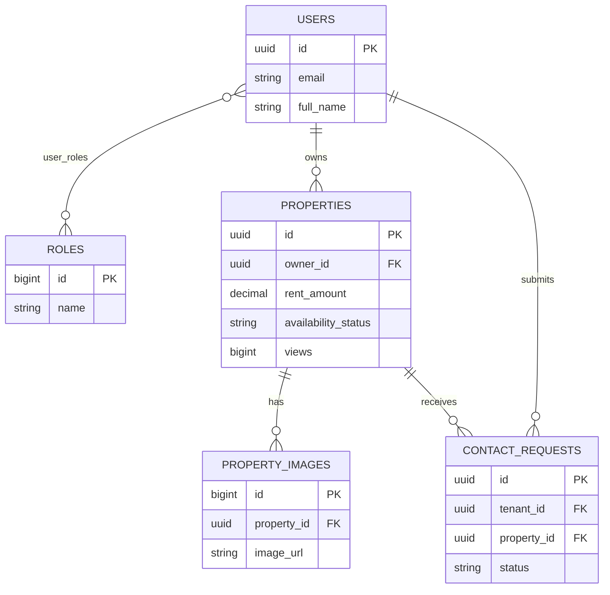
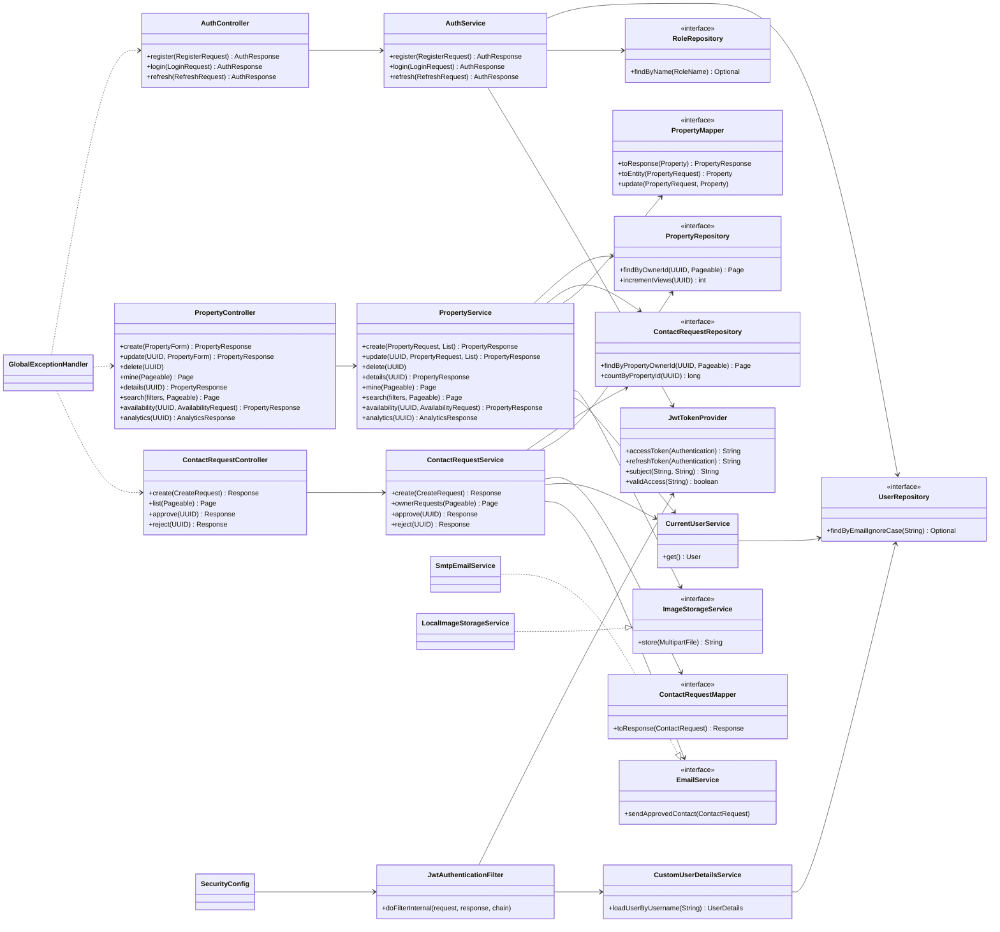
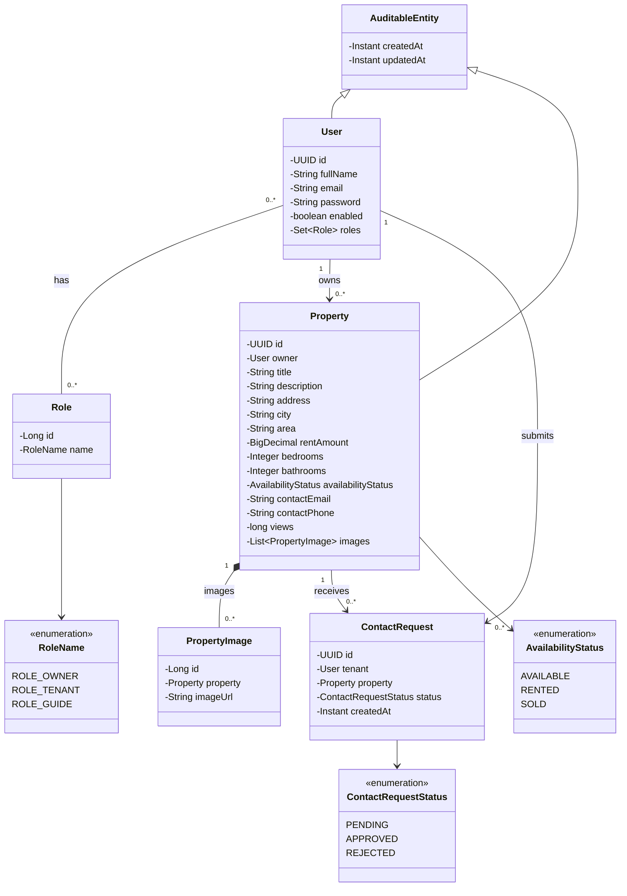
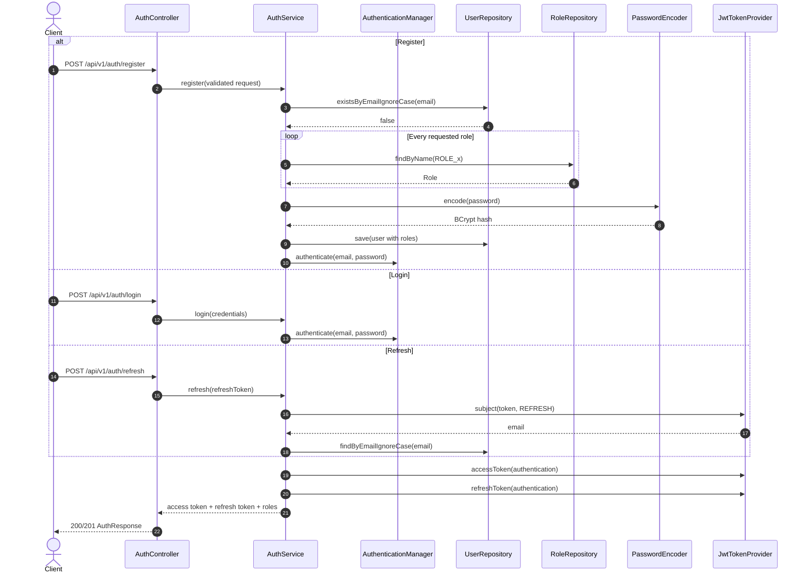
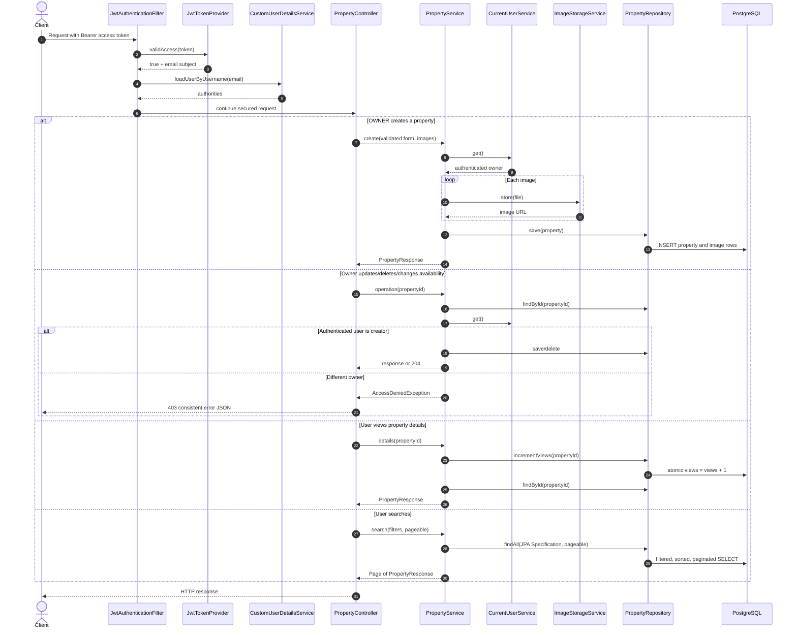
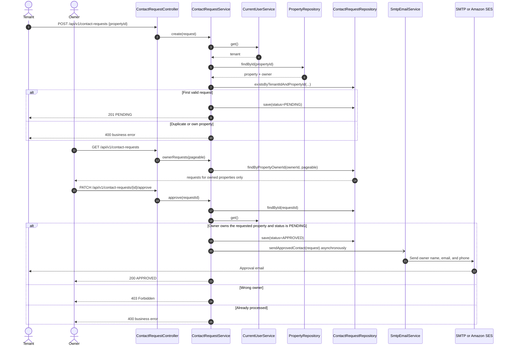

# Prop Ease

Enterprise-style rental property management REST API built with Java 21, Spring Boot 3, PostgreSQL, Flyway, JWT, JPA Specifications, MapStruct, Bean Validation, SMTP email, OpenAPI, Docker, JUnit 5, Mockito, MockMvc, and JaCoCo.

## Architecture

The code uses a layered package structure: controllers accept validated DTOs, transactional services enforce business ownership rules, MapStruct converts domain models, repositories isolate persistence, and a stateless security filter authenticates JWTs. Entities never leave the service layer. Users may simultaneously hold OWNER, TENANT, and GUIDE roles.

```text
HTTP / Swagger -> SecurityFilterChain + JWT filter -> Controllers
                                                   -> Services -> Repositories -> PostgreSQL
                                                               -> Image storage
                                                               -> SMTP / SES
```

Local development stores uploaded images in `uploads/`. `ImageStorageService` is the extension point for an S3 implementation in production.

## ER diagram



## Class diagrams

To edit a diagram visually in draw.io, copy the contents of its Mermaid block and use **Arrange → Insert → Advanced → Mermaid**. Keep the Mermaid source in this README as the version-controlled source of truth.

### Application-wide class diagram

This diagram shows the complete request path and the principal dependency direction. Solid arrows represent runtime dependencies; repository interfaces are implemented by Spring Data at runtime.



### Domain class diagram



## Sequence diagrams

### Registration, login, and token refresh



### Authenticated property operations



### Contact request approval and email delivery



The same ownership check is used for rejection; rejection changes the state to `REJECTED` and does not send an email.

## Prerequisites and local setup

- JDK 21
- Maven 3.9+
- Docker Desktop

Recommended local development flow: run PostgreSQL in Docker and run the Spring Boot API with Maven on your machine.

Start PostgreSQL only:

```powershell
cd D:\JAVA\prop-ease
docker compose up -d postgres
```

Then run the API locally with Maven:

```powershell
cd D:\JAVA\prop-ease
mvn test
mvn spring-boot:run
```

If your default Java is older than 21, point the terminal to a newer JDK before running Maven. For example, on this machine JDK 22 is available:

```powershell
$env:JAVA_HOME='C:\Program Files\Java\jdk-22'
$env:Path="$env:JAVA_HOME\bin;$env:Path"
java -version
```

For this Maven-local mode, the app reads `D:\JAVA\prop-ease\application-override.yaml`. The default local database connection is:

```yaml
spring:
  datasource:
    url: jdbc:postgresql://localhost:5433/rentaldb
    username: postgres
    password: postgres
```

Use `localhost` here because the Spring Boot app is running on your machine while PostgreSQL is exposed from Docker on host port `5433`. Inside Docker, PostgreSQL still listens on container port `5432`.

Flyway automatically creates all tables, indexes, constraints, and the three role records. Hibernate is set to `validate`, so schema drift fails fast.

## Docker

Full Docker mode is also available for later deployment-style local testing. In this mode both the app and PostgreSQL run inside Docker, so the app uses `postgres` as the database host instead of `localhost`.

```powershell
Copy-Item .env.example .env
# Replace JWT_SECRET in .env
docker compose up --build -d
docker compose logs -f app
docker compose down
```

PostgreSQL is exposed on host port `5433` and the API on `8080`. Database and image volumes persist across restarts.

## Authentication

Register with role names without the `ROLE_` prefix:

```json
{
  "fullName": "John Doe",
  "email": "john@example.com",
  "password": "Password@123",
  "roles": ["OWNER", "TENANT"]
}
```

Use the returned access token as `Authorization: Bearer <token>`. Access tokens default to 15 minutes and refresh tokens to seven days; both are configurable through environment variables. Refresh tokens are type-bound and cannot authenticate API requests. Changing a password or disabling a user should be paired with a production token-revocation strategy if immediate invalidation is required.

## API documentation

Swagger UI: `http://localhost:8080/swagger-ui.html`

When the application reaches the ready state, it prints the Swagger UI URL, OpenAPI JSON URL, and a sorted catalog of every application endpoint to the startup log. The catalog includes each route's HTTP method, path, controller, and handler method. Springdoc independently discovers the same controller routes and displays them in Swagger UI.

```text
================ PROP EASE API ================
Swagger UI : http://localhost:8080/swagger-ui.html
OpenAPI JSON: http://localhost:8080/v3/api-docs
API endpoints:
  POST          /api/v1/auth/login  -> AuthController.login
  GET           /api/v1/properties/search  -> PropertyController.search
  ...
================================================
```

| Method | Path | Authorization |
|---|---|---|
| POST | `/api/v1/auth/register` | Public |
| POST | `/api/v1/auth/login` | Public |
| POST | `/api/v1/auth/refresh` | Public |
| POST | `/api/v1/properties` | OWNER |
| PUT / DELETE | `/api/v1/properties/{id}` | Creating owner |
| GET | `/api/v1/properties/my` | OWNER |
| GET | `/api/v1/properties/{id}` | Authenticated; increments views atomically |
| GET | `/api/v1/properties/search` | Authenticated; paginated and sortable |
| PATCH | `/api/v1/properties/{id}/availability` | Creating owner |
| GET | `/api/v1/properties/{id}/analytics` | Creating owner |
| POST | `/api/v1/contact-requests` | TENANT |
| GET | `/api/v1/contact-requests` | OWNER; own properties only |
| PATCH | `/api/v1/contact-requests/{id}/approve` | Owning OWNER; sends email |
| PATCH | `/api/v1/contact-requests/{id}/reject` | Owning OWNER |

Property create/update uses `multipart/form-data` with the documented scalar fields and zero or more `images` files. Search supports `city`, `area`, `rentMin`, `rentMax`, `bedrooms`, `bathrooms`, `availability`, `postedAfter`, `page`, `size`, and `sort`, for example:

```text
GET /api/v1/properties/search?city=Hyderabad&area=Kondapur&bedrooms=2&bathrooms=2&rentMax=30000&page=0&size=10&sort=rentAmount,asc
```

## Configuration

No production secret is committed. Important environment variables are `DB_URL`, `DB_USERNAME`, `DB_PASSWORD`, `JWT_SECRET`, `JWT_ACCESS_EXPIRATION_MS`, `JWT_REFRESH_EXPIRATION_MS`, `SMTP_HOST`, `SMTP_PORT`, `SMTP_USERNAME`, `SMTP_PASSWORD`, `SMTP_AUTH`, `SMTP_STARTTLS`, `IMAGE_DIRECTORY`, and `IMAGE_BASE_URL`.

### External override file

The base `src/main/resources/application.yml` imports the external override file through `APP_OVERRIDE_FILE`. If the variable is not set, it defaults to the local project file at `D:/JAVA/prop-ease/application-override.yaml`:

```yaml
spring:
  config:
    import: optional:file:${APP_OVERRIDE_FILE:D:/JAVA/prop-ease/application-override.yaml}
```

Values in `application-override.yaml` override matching base values. Because the import is optional, the packaged application can still start when the file is absent. Keep local or environment-specific changes in this override file instead of editing the base configuration. The override is excluded from Git so credentials are not accidentally committed.

For IntelliJ/local Maven, no extra setting is required when the project lives at `D:\JAVA\prop-ease`. If you move the project, set this environment variable in the IntelliJ Run Configuration or terminal:

```powershell
cd D:\JAVA\prop-ease
$env:APP_OVERRIDE_FILE='D:/JAVA/prop-ease/application-override.yaml'
mvn spring-boot:run

# Packaged JAR—the same external override is loaded
java -jar target\prop-ease-1.0.0.jar
```

Docker Compose mounts `application-override.yaml` into `/app/application-override.yaml` as read-only and sets `APP_OVERRIDE_FILE=/app/application-override.yaml`, so the same override mechanism works inside the container.

## Tests and coverage

```powershell
mvn clean verify
```

The suite contains security-token unit tests, service tests with Mockito, controller validation tests with MockMvc, and JaCoCo reporting at `target/site/jacoco/index.html`. Add tests with every behavior change and maintain at least 70% line coverage in CI. `mvn test` runs the current tests; `mvn clean verify` also enforces the configured coverage gate.

Code style is enforced during Maven's `validate` phase. Spotless applies Google Java Format and removes unused imports; Checkstyle rejects wildcard and unused imports.

```powershell
# Reformat source and test code
mvn spotless:apply

# Verify formatting and imports without changing files
mvn spotless:check checkstyle:check
```

## AWS deployment

1. Create private subnets and security groups. Permit the application security group to reach RDS on 5432; do not expose RDS publicly.
2. Create RDS PostgreSQL with encryption, automated backups, Multi-AZ for production, and credentials stored in Secrets Manager. Set `DB_URL`, `DB_USERNAME`, and `DB_PASSWORD` from those secrets.
3. Build the image, push it to ECR, and run it on EC2 (or ECS) behind an HTTPS Application Load Balancer. Give the instance/task an IAM role instead of static AWS keys. Store `JWT_SECRET` in Secrets Manager or SSM Parameter Store.
4. Create a private S3 bucket with block-public-access, encryption, lifecycle rules, and CloudFront or presigned URLs. Implement the existing `ImageStorageService` with AWS SDK v2; persist only the resulting object URL/key.
5. Verify an SES domain/address, move the account out of the sandbox, grant only `ses:SendEmail`, and supply the SES SMTP endpoint and credentials through the SMTP environment variables. Use TLS on port 587.
6. Run Flyway during a single controlled deployment task before scaling out. Configure health checks, CloudWatch logs/alarms, WAF, backups, least-privilege IAM, and rolling or blue/green deployments.

## Production notes

- Put the API behind TLS and configure an explicit CORS allow-list.
- Replace local image storage with S3 and add malware/content validation.
- Consider refresh-token rotation with hashed token persistence for logout and revocation.
- Rate-limit authentication, property views, and contact requests.
- Use a queue/outbox for reliable email delivery at scale.
